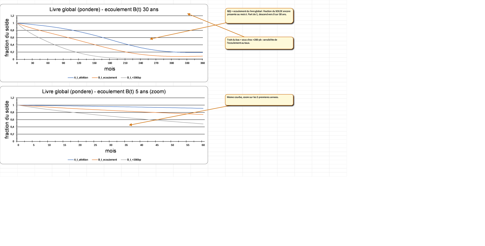

# runoff_model — how fast do bank deposits drain?

A pure-Python model of the **run-off of non-maturing bank deposits** — the input an
ALM / Treasury desk needs to measure interest-rate risk on accounts that can be
withdrawn any day but in practice stay for years. Built for an Algerian bank, and
deliberately constrained to run on a locked-down workstation using **only the Python
standard library** (no numpy, pandas, or scikit-learn).

## The problem it solves
Current-account and savings deposits have **no contractual maturity** — a customer
*could* withdraw everything tomorrow, yet a large, stable core stays for years. To
manage interest-rate risk under the Basel/EBA **IRRBB** framework, a bank must estimate
the **run-off curve**: of the balance sitting there today, how much is still there in
1, 12, 60, … months? This project estimates that curve from monthly balance history and
turns it into the regulatory risk numbers.

## What it produces
- **A(t)** — the survival curve (probability an account is still open over time), from a
  discrete-time **hazard** model.
- **r(t)** — balance erosion on the accounts that stay. Together **B(t) = A(t)·r(t)** is
  the book's run-off curve.
- **Whole-book aggregation** across deposit products (current-account DZD & FX, savings,
  overdrafts, …), each modelled separately then combined by balance weight.
- **IRRBB outputs** — ΔEVE / ΔNII (change in economic value & net interest income) under
  the ±200 bp and the six EBA rate scenarios.
- **Uncertainty, not just point estimates** — Monte-Carlo macro & crisis-stress fans,
  conformal calibration, and walk-forward / purged-CPCV validation.
- **Reports** — a self-contained `report.html` and a native **Excel** `report.xlsx`
  (embedded charts + tables), both written by hand on the standard library.

> **📊 See the report, sheet by sheet →** [**Visual guide to `report.xlsx`**](tutorial/README.md)
> — an annotated screenshot of all 29 sheets.

[](tutorial/README.md)

*The headline output — the whole-book run-off curve `B(t)` over 30 years, with the ±200 bp stress
(synthetic demo data). [Full walkthrough of every sheet →](tutorial/README.md)*

## What's notable about it
- **Standard library only.** The target is a bank PC with no scientific-Python stack, so
  *everything* is hand-written on the stdlib — the linear algebra, the elastic-net
  logistic solver, the HMM, the bootstrap, and even the `.xlsx` reader **and writer**.
- **Governance-first, not a black box.** IRRBB models must be explainable and auditable,
  so the core is a penalized logistic **hazard** + **error-correction** model. A
  gradient-boosting challenger is included and *loses* out-of-sample — documented, not
  hidden.
- **No look-ahead, by construction.** Purged/embargoed cross-validation, point-in-time
  macro joins, and train-only fits throughout.

## Status (honest)
The engine is **complete and synthetic-validated**: the full self-test suite is green and
the whole pipeline runs end-to-end on synthetic data. It has **not yet been run on the
real client panel** — that's the remaining step and happens on the bank's PC. Any numbers
in the code or tests come from synthetic data.

## Mini-glossary
| Term | Meaning |
|------|---------|
| **DAV** | *dépôts à vue* — demand / current-account deposits (the primary book) |
| **NMD** | non-maturing deposits (no contractual maturity date) |
| **IRRBB** | Interest Rate Risk in the Banking Book (Basel / EBA framework) |
| **Run-off / S(t), B(t)** | how the balance decays over time |
| **ΔEVE / ΔNII** | change in economic value of equity / net interest income under a rate shock |
| **EFM** | *État Financier Mensuel* — the monthly bank extract the real data comes from |

## Layout
| Path | What |
|------|------|
| `src/data/`   | Macro data layer (IMF / World Bank / oil / parallel-FX). **Needs internet.** |
| `src/model/`  | The numerical + statistical kit: hazard, erosion, HMM/regimes, structural breaks, IRRBB (ΔEVE/ΔNII), Monte-Carlo stress, and the pure-stdlib `.xlsx` writer. `run_tests.py` runs every module's self-test. |
| `src/panel/`  | Data ingestion: `efm_convert_xls.ps1` (Excel `.xls`→`.xlsx`), `efm_collect.py` (stdlib `.xlsx` reader → client panel), `panel_builder.py` (builds the survival panel). |
| `src/runoff_*.py`, `src/run_pipeline.py` | Orchestration: download → panel → fit → daily score → stress → report. |
| `doc/` | Theory companion (markdown + built PDF) — the maths behind the model. |
| `tutorial/` | **Visual guide to the Excel report** — an annotated screenshot of every sheet ([tutorial/README.md](tutorial/README.md)), plus the Excel-COM script that generates them. |

## Requirements
- **Python 3.10**, standard library only.
- **Excel** on the work PC — the bank's EFM workbooks are the legacy `.xls` format; pure
  stdlib reads `.xlsx`, so Excel converts them once via `efm_convert_xls.ps1`.

## Try the demo (no bank data needed)
```
python src/model/run_tests.py        # run every self-test (expect all green)
python src/run_pipeline.py --demo    # full pipeline end-to-end on synthetic data
```

## Real run (on the bank PC) — 2 commands
See **[TRANSFER.md](TRANSFER.md)** for the full walkthrough. In short:
```
powershell src/panel/efm_convert_xls.ps1 -Root "<...\Controle_de_gestion>" -OutDir "<...\EFM_converted>"
python src/run_pipeline.py --data-dir "<...\EFM_converted>"
```
`run_pipeline.py` auto-detects whether `--data-dir` holds the old `DAV_*.txt` dumps or a
converted EFM tree (`06-EFM/*.xlsx`), builds the survival panel, fits, and writes the
reports — adapting automatically to shorter history.

**For day-to-day operation** — every command, all the flags, what-if re-runs, troubleshooting,
and how to read the Excel report — see **[GUIDE.md](GUIDE.md)**.

## Code only, never data
No client data and no pipeline outputs are ever committed. The `.gitignore` enforces it
(`_out/`, `_artifacts/`, `_synth/`, `panel/_out/`, and all `*.csv` / `*.xlsx`). The one
tracked data file is `src/data/regime_events.csv` — a hand-authored calendar of *public,
documented* Algerian macro episodes that the model reads as an input.
