# Visual guide to the Excel report (`report.xlsx`)

A screenshot walkthrough of **every sheet** of the Excel report the pipeline produces
(`report.xlsx`, 29 sheets). The report's own language is **French** (its ALM / Treasury
audience), so the arrows and captions drawn on the key sheets are in French; this page
explains each sheet in English.

> ⚠️ **All screenshots are of the SYNTHETIC demo report** — built with
> `python src/run_pipeline.py --demo`, with **no client data** anywhere. On the bank PC the
> same sheets appear with the real EFM panel; the layout is identical, only the numbers change.

🔎 = sheets that carry tutorial arrows pointing at what to read.
Click any image to open it full-resolution.

**Contents**
1. [Start here](#1-start-here) · 2. [The headline result](#2-the-headline-result) ·
3. [Model quality](#3-model-quality) · 4. [Interest-rate risk (IRRBB)](#4-interest-rate-risk-irrbb) ·
5. [Stress & uncertainty](#5-stress--uncertainty) · 6. [Regime & monitoring](#6-regime--monitoring) ·
7. [Data & reference](#7-data--reference)

---

## 1. Start here

### 01 · Glossaire
Definitions of every term used in the report — `A(t)`, `r(t)`, `B(t)`, WAL, ΔEVE, regime, …
Read this first for the vocabulary.

[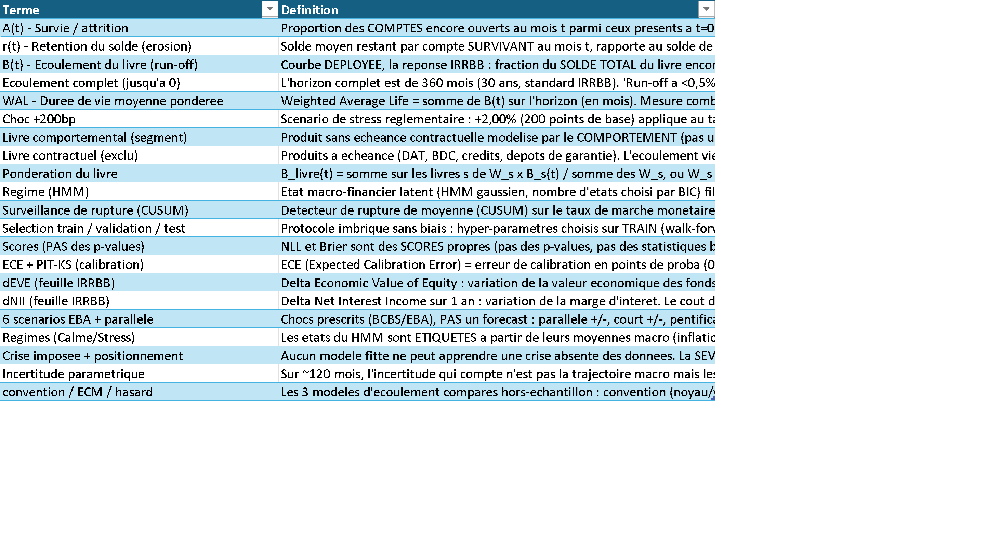](screenshots/01_Glossaire.png)

### 02 · Guide
The report's own table of contents: what each sheet is for and what to look at, in plain French.

[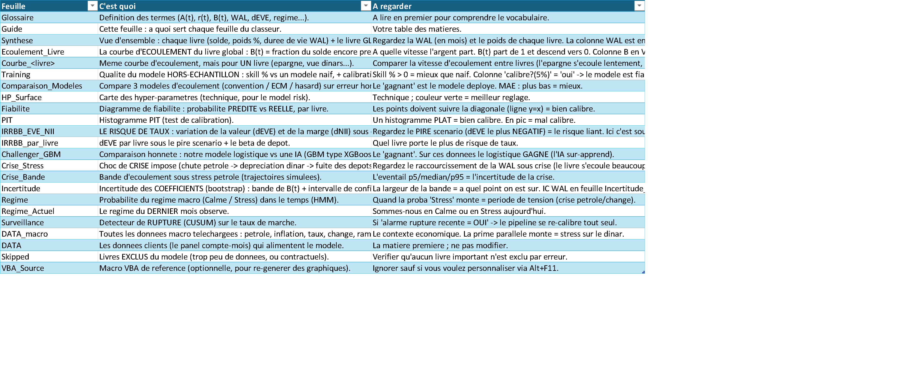](screenshots/02_Guide.png)

---

## 2. The headline result

### 03 · Synthese 🔎
The overview: each deposit book (balance, weight %, average life **WAL** in months) plus the
whole-book **BOOK** row. The WAL column is green — it says how long, on average, the money stays.

[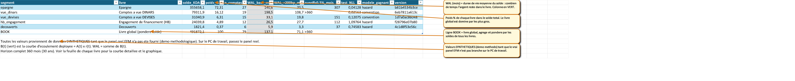](screenshots/03_Synthese.png)

### 04 · Ecoulement_Livre 🔎
The whole-book **run-off curve** `B(t)` — the fraction of today's balance still present at month
`t`, out to 30 years (a full-horizon chart + a 5-year zoom). This is the headline IRRBB input:
how fast the money drains.

[](screenshots/04_Ecoulement_Livre.png)

### 05 · Courbe_vue_dinars 🔎
The same run-off curve for a **single book** — current-account dinars (the primary DAV).
`B(t) = A(t) · r(t)`: account attrition × balance erosion.

[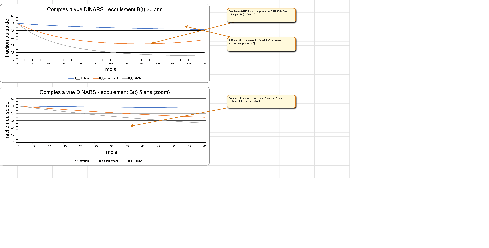](screenshots/05_Courbe_vue_dinars.png)

### 06–09 · Courbe_&lt;book&gt;
The same curve, one sheet per book. Compare the drain speed across books — savings run off
slowly, overdrafts fast.

| Savings | FX current-accounts |
|---|---|
| [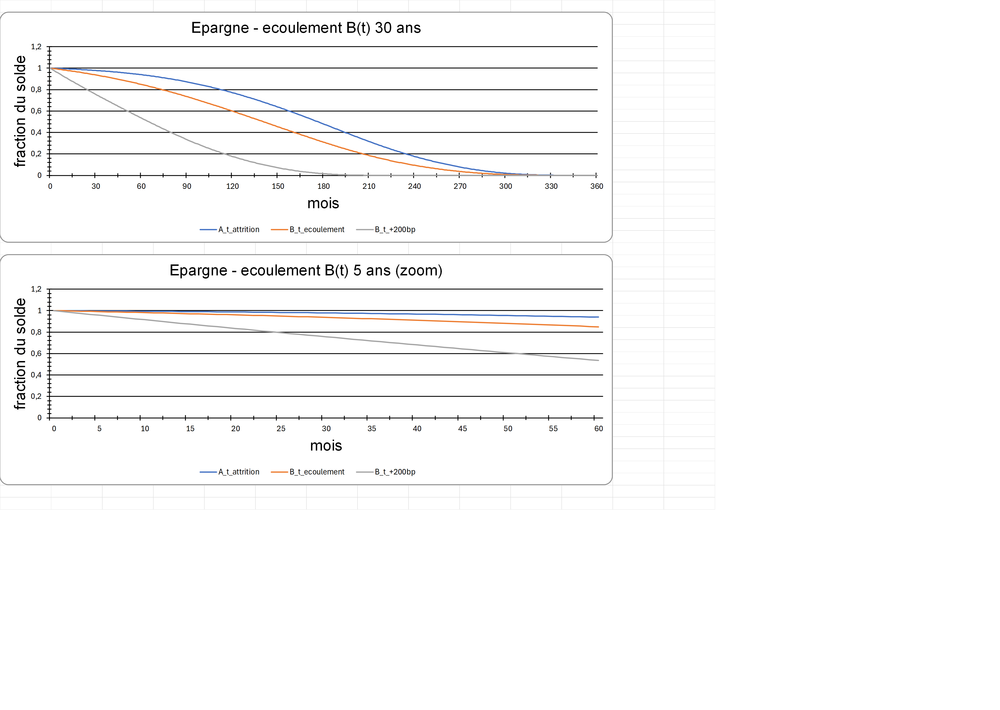](screenshots/06_Courbe_epargne.png) | [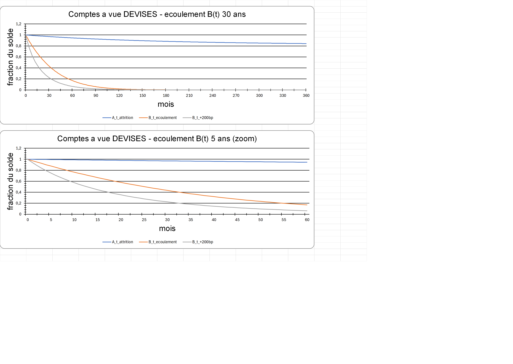](screenshots/07_Courbe_vue_devises.png) |

| HB financing commitment | Overdrafts |
|---|---|
| [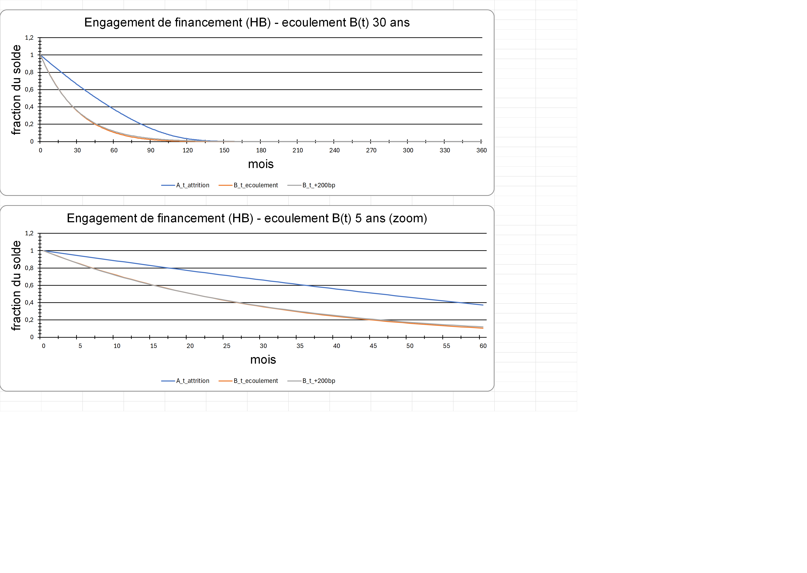](screenshots/08_Courbe_hb_engagement.png) | [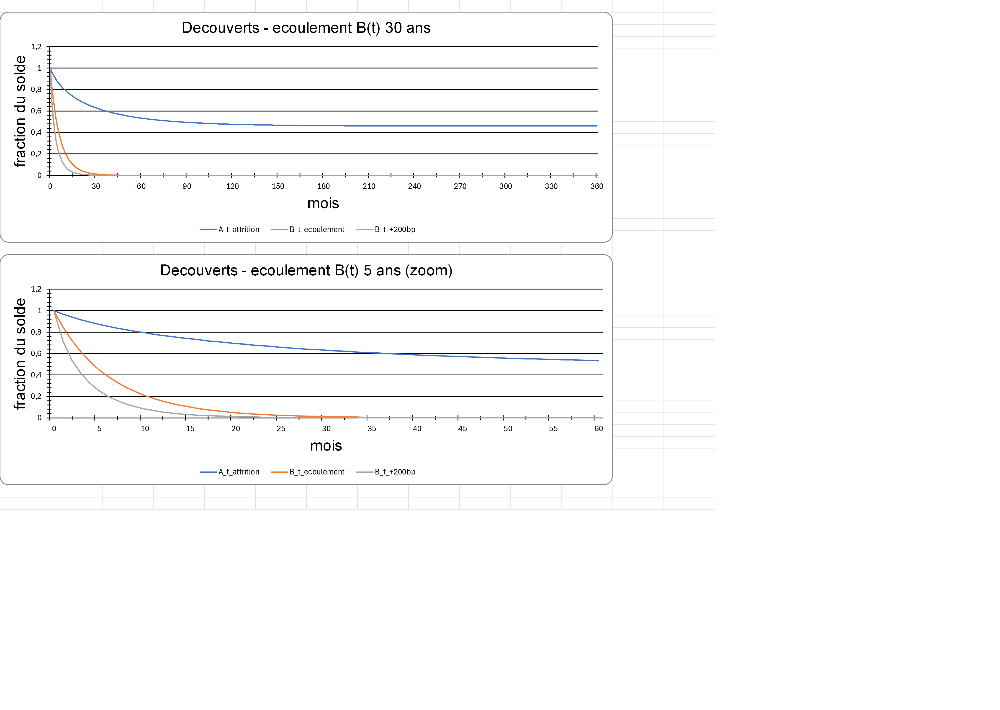](screenshots/09_Courbe_decouverts.png) |

---

## 3. Model quality

### 10 · Training 🔎
Out-of-sample model quality: **skill %** versus a naive base-rate model, plus calibration
(ECE, PIT-KS). `calibré?(5%) = oui` means the predicted probabilities are trustworthy.
Honest finding: the skill % can be *negative* — on a rare monthly event the hazard barely beats
the naive baseline; the model's value is in the **calibrated curve**, not month-ahead discrimination.

[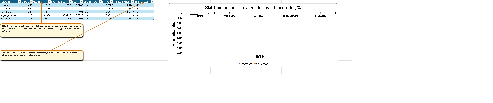](screenshots/10_Training.png)

### 11 · Comparaison_Modeles 🔎
Compares the three run-off models — **convention** (regulatory) / **ECM** (econometric) /
**hazard** (behavioural `A·r`) — on out-of-sample error. The `gagnant` (winner) is the one
deployed per book. Lower MAE = better fit to the realised run-off.

[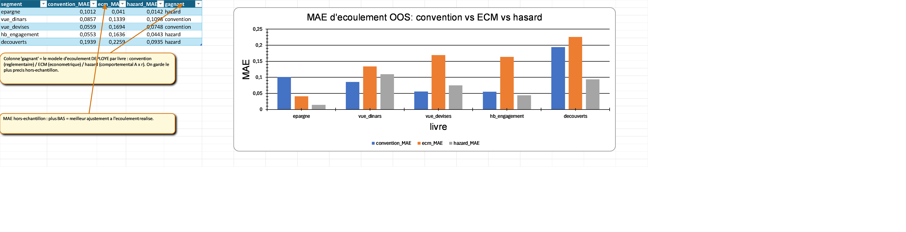](screenshots/11_Comparaison_Modeles.png)

### 12 · HP_Surface_epargne
Hyper-parameter map (technical, for model risk) — the λ × α grid, green = best setting.
Flat here because the surface is genuinely flat on synthetic data.

[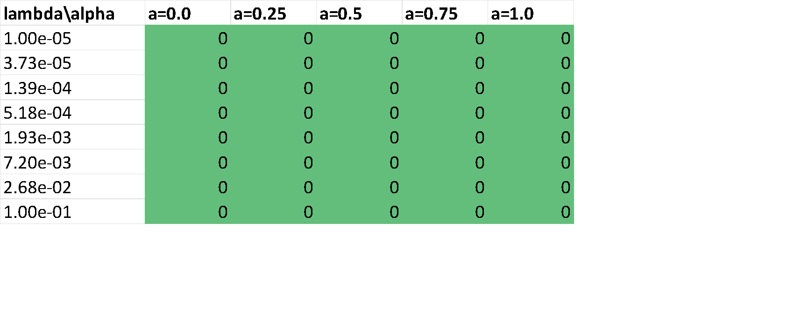](screenshots/12_HP_Surface_epargne.png)

### 13 · Fiabilite 🔎
Reliability diagram: **predicted** probability (x) vs **actual** (y), one panel per book.
Points should follow the `y = x` diagonal — that's well-calibrated.

[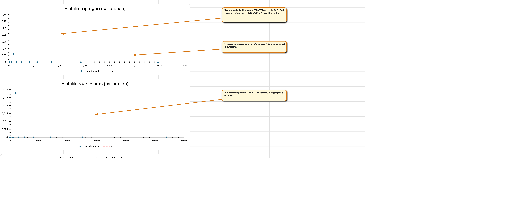](screenshots/13_Fiabilite.png)

### 14 · PIT
The PIT histogram (another calibration test). A **flat** histogram = well-calibrated; a spiked
one = mis-calibrated.

[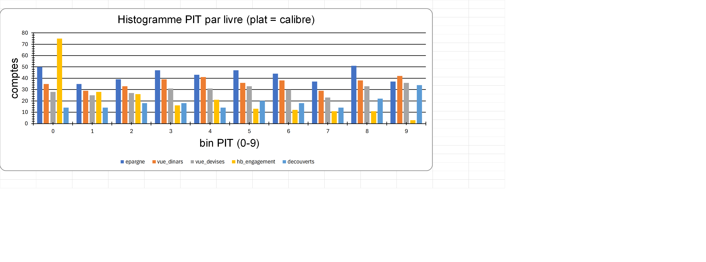](screenshots/14_PIT.png)

### 17–18 · Challenger_GBM / Challenger_bars
The honest challenger check: our explainable **logistic hazard** vs a **gradient-boosting**
model (XGBoost-style), out-of-sample. The logistic **wins** — the GBM overfits on ~120 months
of rare-event data. Documented, not hidden.

| Table | Bars |
|---|---|
| [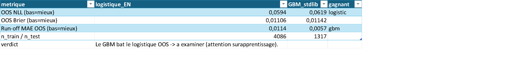](screenshots/17_Challenger_GBM.png) | [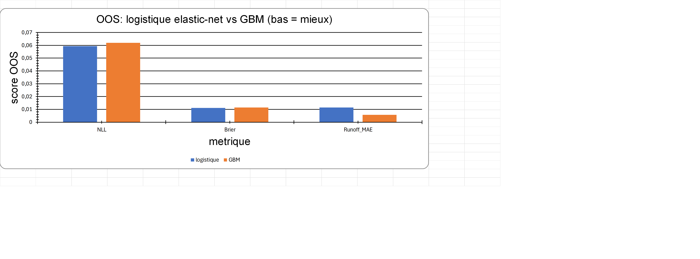](screenshots/18_Challenger_bars.png) |

---

## 4. Interest-rate risk (IRRBB)

### 15 · IRRBB_EVE_NII 🔎
**The interest-rate risk output**: ΔEVE (economic value) and ΔNII (net interest income) under
each rate shock — the 6 EBA scenarios plus ±200 bp. Read the **worst** case (most negative ΔEVE)
= the binding risk. For a deposit book that is usually a rate **cut** (deposits are long, cheap
funding), so `-200 bp` / `parallèle -` bites hardest.

[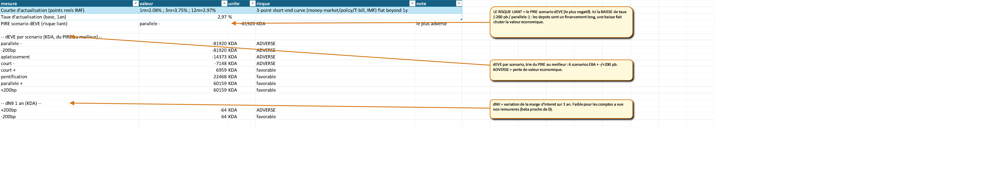](screenshots/15_IRRBB_EVE_NII.png)

### 16 · IRRBB_par_livre
ΔEVE per book under the worst scenario, plus each book's deposit **beta** — which book carries
the most rate risk.

[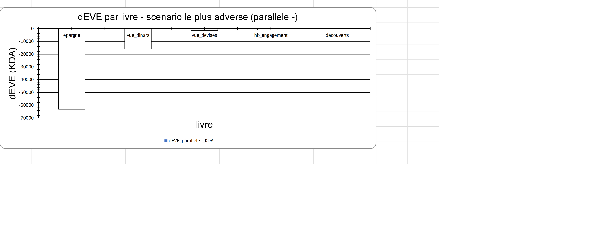](screenshots/16_IRRBB_par_livre.png)

---

## 5. Stress & uncertainty

### 19 · Crise_Stress 🔎
An **imposed crisis** shock (oil crash → dinar depreciation → deposit flight). The severity is a
**hypothesis** (to be anchored on the 2014-16 episode), *not* a forecast — no fitted model learns
a crisis absent from the data. Watch the WAL collapse (here 137 → ~6 months).

[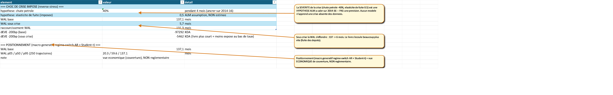](screenshots/19_Crise_Stress.png)

### 20 · Crise_Bande
The run-off **band** under the oil-stress simulation — the p5 / median / p95 fan is the crisis
uncertainty.

[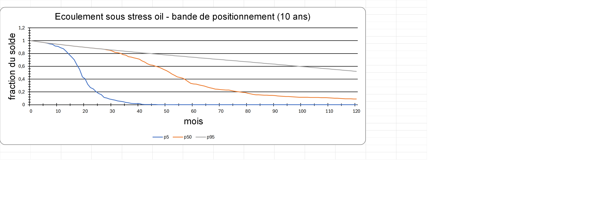](screenshots/20_Crise_Bande.png)

### 21–22 · Incertitude / Incertitude_WAL
**Coefficient** uncertainty (block bootstrap → refit): a `B(t)` band and a confidence interval on
the WAL. The band width tells you how sure the estimate is — on ~120 months the binding
uncertainty is the coefficients, not the macro path.

| B(t) band | WAL interval |
|---|---|
| [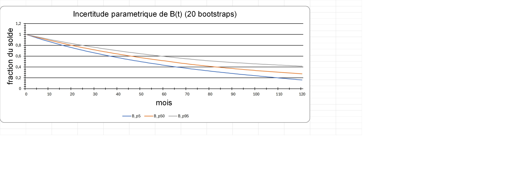](screenshots/21_Incertitude.png) | [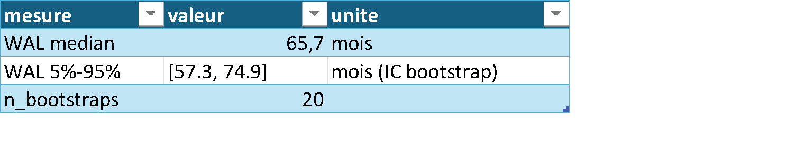](screenshots/22_Incertitude_WAL.png) |

---

## 6. Regime & monitoring

### 23 · Regime
Macro-regime probability (**Calm / Stress**) over time, from a filtered HMM. When the *Stress*
probability rises, that's a period of tension (oil / FX).

[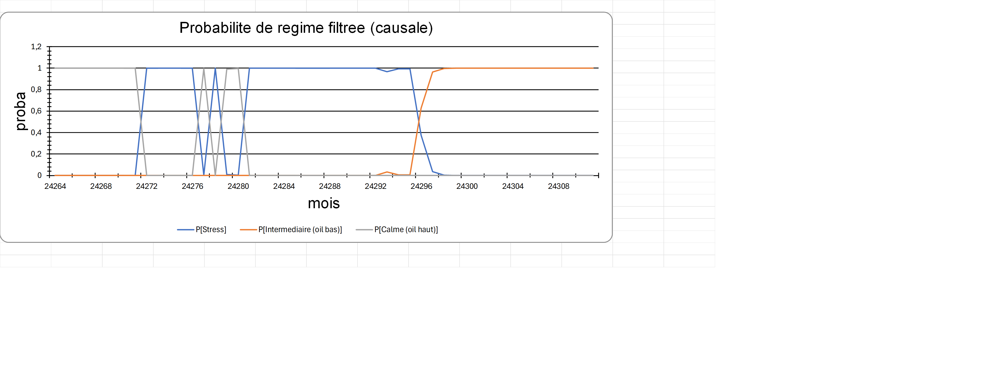](screenshots/23_Regime.png)

### 24 · Regime_Actuel 🔎
The regime of the **last observed month** — are we in Calm or Stress today. The number of regimes
K is chosen by BIC.

[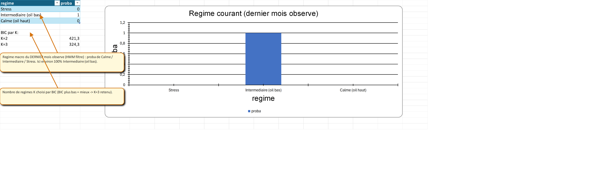](screenshots/24_Regime_Actuel.png)

### 25 · Surveillance 🔎
A **CUSUM break detector** on the market rate. If a recent break alarm fires, the pipeline
recommends (and can auto-trigger) a recalibration. Here: no recent alarm → routine mode.

[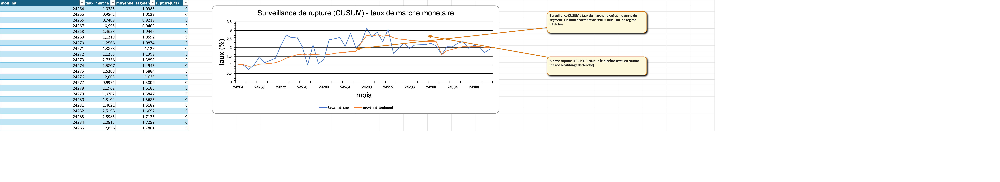](screenshots/25_Surveillance.png)

---

## 7. Data & reference

### 26 · DATA_macro
Every downloaded macro series — oil, inflation, rates, FX, Ramadan seasonality, and the
**parallel-market premium** (real, scraped since 2016) — with charts. The economic context the
model conditions on.

[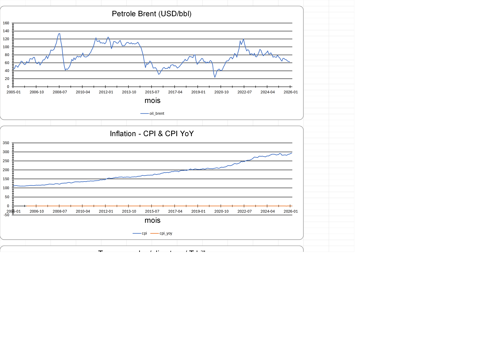](screenshots/26_DATA_macro.png)

### 27 · DATA
The client **panel** (account-month rows) that feeds the model. The raw material — only the first
rows are shown here; the real sheet has tens of thousands.

[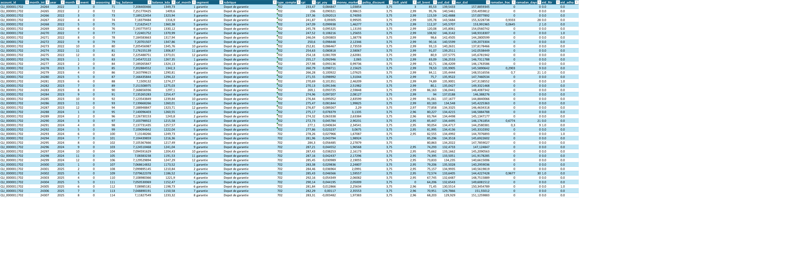](screenshots/27_DATA.png)

### 28 · Skipped
Books **excluded** from the model (too little history, or contractual products with a schedule
instead of behaviour). Check nothing important was dropped — here: *aucun livre exclu* (none).

[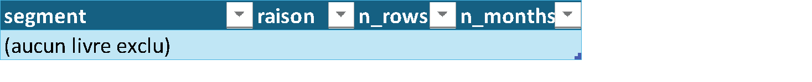](screenshots/28_Skipped.png)

### 29 · VBA_Source
A reference VBA macro (text only, optional) for a power user who wants to regenerate a chart.
The charts are already native `.xlsx` objects, so this is not needed to view the report.

[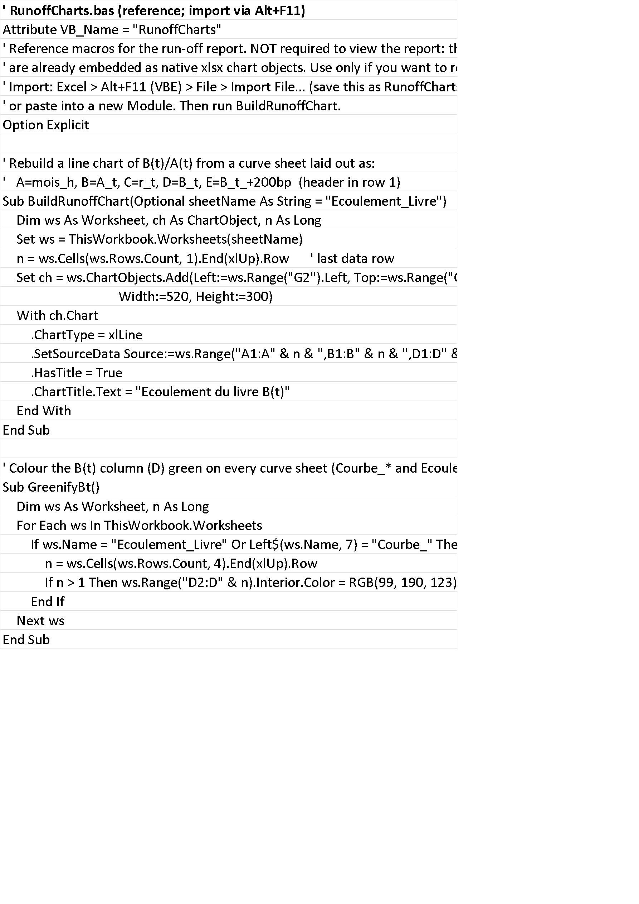](screenshots/29_VBA_Source.png)

---

## Regenerating these screenshots

The images are produced from a locally-built `report.xlsx` by an Excel-COM script — a
**documentation tool only**, entirely separate from the pure-stdlib pipeline (it never runs on
the bank PC):

```powershell
# 1) build a report.xlsx (demo data)
python src/run_pipeline.py --demo
# 2) screenshot every sheet (+ draw the French tutorial arrows on the headline sheets)
powershell tutorial/make_screenshots.ps1
```

- Requires **Excel** (uses COM, like `efm_convert_xls.ps1`) — no extra Python packages.
- The report is opened **read-only** and closed without saving; the `.xlsx` is never modified.
- The arrows/captions live in [`annotations.json`](annotations.json) (anchored to exact cells or
  chart points); edit that file to change them, then re-run.
- `powershell tutorial/make_screenshots.ps1 -Only Synthese,IRRBB_EVE_NII` regenerates just a few.
